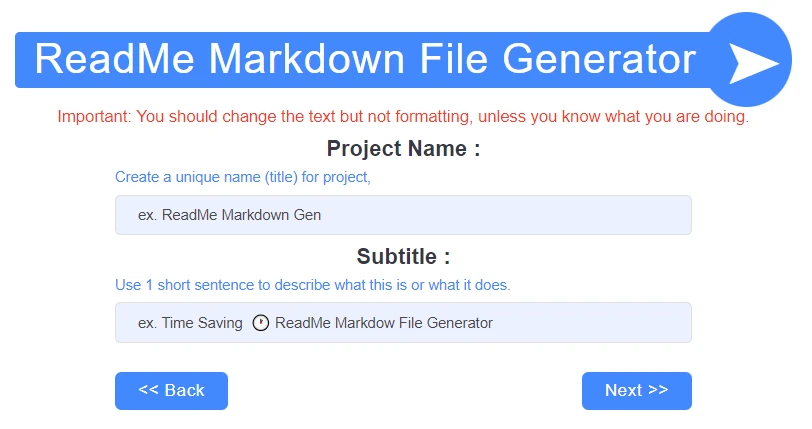
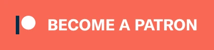

<!--------------------------------------------------------------------------------------------------------
This README.md file was generated using web app repository available at github.com/nicoleweathers/ReadMeGen
---------------------------------------------------------------------------------------------------------->

<p align="center">
  
</p>

<p style="font-family:"Open Sans",sans-serif;letter-spacing:2px;background-image:linear-gradient(45deg,#415ed0 0%,#c850c0 46%,#ffcc70 100%);text-align:center;padding:7px 10px;font-size:3.5em;font-weight:700;color:#fff;margin-bottom:0">ReadMe Markdown Gen<span class="banner1desc">Time Saving  🕐 ReadMe Markdown File Generator</span></p>
        

<p align="center" style="font-size:.4em;font-weight:400;color:#fff;margin-top:0;display:block"><strong>⭐ Star us on GitHub — it's easy & it fuels us!</strong></p>

<p class="key_feat"> 
    <a href="#-key-features">&bull; Key Features</a> &bull; 
    <a href="#-about">About</a> &bull; 
    <a href="#-installation">Installation</a> &bull; 
    <a href="#-license">License</a> &bull; 
    <a href="#-how-it-works">How It Works</a> &bull; 
    <a href="#-download">Download</a> 
</p>

<p align="center">
  
</p>

---
<a id="readme-top"></a>

# Table of Contents

<details open>
<summary> &nbsp; &#9756; </summary> <br />

- [Key Features](#-key-features) 
- [About](#-about)
- [Demo](#-demo)
- [Dependencies](#-dependencies)
- [Installation](#-installation)
- [Download](#download)
- [Output Structure](#output-structure)
- [How It Works](#-how-it-works)
- [License](#-license)
- [Support](#-support)
- [Contribute](#-contribute)
- [Contacts](#-contacts)
  
</details>

<br>


[( ↑ Back to top ↑ )](#readme-top)

---        
        

## &#9733; Key Features

* Preformatted Markdown - Just change the text
  - Designed to look good and save time.
* Demo Content Auto-Generated
  - Every field in form is pre-filled with demo data
* Unlimited Usage
  - Quickly and easily generate a new README.md file for every repository       


[( ↑ Back to top ↑ )](#readme-top)

---        
        

## &#9733; Screenshots


<details open>
<summary> &nbsp; &#9756; </summary> <br />

<p align="center">
    
&nbsp;
    
</p>

<p align="center">
    
&nbsp;
    
</p> 

</details>


[( ↑ Back to top ↑ )](#readme-top)

---        
        

## &#9733; About

**DRY Obsession** ☜This is my motivation for writing most of the code that I write. 

Will Generate a nicely formatted markdown ReadMe file, which you can also edit if needed or leave as-is and use in your project. Saves a ton of time because you don't have to manually format a MD file. Just fill in the fields you want to add and let the generator do the the rest.

As you can see, it is one of my first repositories (on here), so I created it while brainstorming ideas for how to get in the practice of using GitHub (and GIT). I didn't want to have to spend hours just to write an attractive README file for every project; and that is why this was created. 

I literally spent hours looking at other README files on GitHub to get ideas while determining the essentials and borrowing bits and pieces from several sources to come up with a final master piece. Here, you will find le crème de la crème.


[( ↑ Back to top ↑ )](#readme-top)

---        
        

## &#9733; Demo


[-> See a demo here <-](https://nweathers.neocities.org/readme-md-generator/)


[( ↑ Back to top ↑ )](#readme-top)

---        
        

## &#9733; Dependencies

This project has NO DEPENDENCIES, but if it did, it might look something like this...

This software uses the following open source packages:

- [Electron](http://electron.atom.io/)
- [Node.js](https://nodejs.org/)


[( ↑ Back to top ↑ )](#readme-top)

---        
        

## &#9733; Installation

To clone and run this application, from your command line:

```bash
# Clone this repository
$ git clone https://github.com/nicoleweathers/ReadMeMarkdownGen

# Go into the repository
$ cd readme-gen

# Remove git
$ rm -rf .git

# Initialize git on your machine (optional)
$ git init
```


[( ↑ Back to top ↑ )](#readme-top)

---        
        

## Download


You can [download](https://github.com/nicoleweathers/ReadMeMarkdownGen/archive/refs/heads/main.zip) the file instead of cloning.


[( ↑ Back to top ↑ )](#readme-top)

---        
        

## Output Structure
<details open>
<summary> &nbsp; &#9756; </summary> <br />

```shell
readme-gen/
├── classes
│   ├── Form.php
│   └── ReadMe.php
├── css
│   ├── form.css
│   └── style.css
├── inc
│   ├── form-settings.php
│   ├── functions.php
│   └── init.php
├── md-files
│    └── imgs
│       ├── img1.webp
│       ├── img2.webp
│       ├── img3.webp
│       ├── img4.webp
│       ├── logo.webp
│       └── screenshot.gif
├── download.php
├── end_session.php
├── favicon.ico
├── form.php
├── generate.php
├── go.php
├── index.php
├── instructions.txt
├── README.md
└── results.php
```

</details>

[( ↑ Back to top ↑ )](#readme-top)

---        
        

## &#9733; How It Works

1. Add to htdocs (Xampp) local server and open in browser.
2. Select what you want to include in markdown file.
3. Complete multi-step form with your information
4. Markdown file is generated. Rename it or it will get overwritten next time you run application.
5. If you need to make changes, go back to form. Session data is saved for 30 minutes or until you close browser.


[( ↑ Back to top ↑ )](#readme-top)

---        
        

## 📃 License


[`ReadMe Markdown Gen`](https://github.com/nicoleweathers/ReadMeMarkdownGen) is free and open-source software licensed under 
the Apache 2.0 `License`. Official project was 
created by [Nicole Weathers](https://github.com/nicoleweathers) and distributed under 
`Creative Commons`.


[( ↑ Back to top ↑ )](#readme-top)

---        
        

## &#10084; Support

<a href="https://www.buymeacoffee.com/nweathers" target="_blank"></a>      
<a href="https://www.patreon.com/nikkiwebd">
	
</a><br><br>

<p>Or</p>

**Share the project link**  with your network on social media >>>

<a href="https://www.reddit.com/submit?url=https%3A%2F%2Fgithub.com%2Fnweathers%2FReadMeMarkdownGen&title=Awesome%20Readme%20Markdown%20File%20Generator!" target="_blank"></a> 
<a href="https://www.linkedin.com/shareArticle?mini=true&url=https%3A//github.com/nicoleweathers/ReadMeMarkdownGen" target="_blank"></a> 


[( ↑ Back to top ↑ )](#readme-top)

---        
        
## 🐙 Contribute

I would love to see more banner options. These are pure CSS generated banner styles. If you have any other suggestions, you are more than welcome to give feedback. 

1. Fork the Project
2. Create your Feature Branch (`git checkout -b fork/YourContribution`)
3. Commit your Changes (`git commit -m 'Add some YourContribution'`)
4. Push to the Branch (`git push origin fork/YourContribution`)
5. Open a Pull Request
   
You can also simply open an issue with the tag "suggestion".
Don't forget to give the project a star! Thanks again!


[( ↑ Back to top ↑ )](#readme-top)

---        
        
## 🤝 Credits and Acknowledgements

To create this web app, I needed some inspiration, so I searched for good README file recommendations. Ultimately, here are the resources that helped get some good ideas for how to create the ultimate readme.md file:

+ [@matiassingers](https://github.com/matiassingers/awesome-readme) : Saved me time so I didn't have to use a search engine for my research.
+ [amplication](https://github.com/amplication/amplication#readme) : Multiple image screenshots in collapsible section.
+ [ajeetdsouza](https://github.com/ajeetdsouza/zoxide#readme) : Nice file tree.
+ [aimeos-typo3](https://github.com/aimeos/aimeos-typo3#readme) : Nice layout, flow, visually attractive.
+ [EventualShop](https://github.com/AntonioFalcaoJr/EventualShop#readme) : Attractive banner and attractive like [electron-markdownify](https://github.com/amitmerchant1990/electron-markdownify#readme) & [aimeos-typo3](https://github.com/aimeos/aimeos-typo3#readme).
+ [electron-markdownify](https://github.com/amitmerchant1990/electron-markdownify#readme) : 
**BEST BY FAR** - This one was like the starting point for my design because it is attractive yet simple _which is perfect for me. As cool as all those emojis/icons are, it's too overwhelming for me as an autistic person. I like clean yet attractive styles; and this one did it.
+ [werewolves-assistant-api-next](https://github.com/antoinezanardi/werewolves-assistant-api-next#readme) : 
 **Worth mentioning**  I did not use any of their styling for this because it was a bit much for me (autistic). But I love how complete it is and I think it is really worth mentioning.


[( ↑ Back to top ↑ )](#readme-top)

---        
        

## &#x1F517; You may also like...

- [markdownify-web](https://github.com/amitmerchant1990/markdownify-web) - Web version of Markdownify
- [markdown](https://github.com/gomarkdown/markdown) - Markdown parser and HTML render for GO
- [markdown-cheatsheet](https://github.com/tchapi/markdown-cheatsheet) - Markdown Cheatsheet for Github Readme.md
- [markdown-badges](https://github.com/lleriayo/markdown-badges) - Badges for your personal developer branding, profile, and projects


[( ↑ Back to top ↑ )](#readme-top)

---        
        
## &#x1F4AC; Contacts

- **Website**: [Nicole Weathers](https://nweathers.neocities.org)

> GitHub [@nicoleweathers](https://github.com/nicoleweathers)  · 
> YouTube [@webdgem](https://youtube.com/@webdgem)  · 
> LinkedIn [@ms-nicole-weathers](https://linkedin.com/in/ms-nicole-weathers)  · 
> Medium [@iodevy.com](https://medium.com/@iodevy.com)  · 


[( ↑ Back to top ↑ )](#readme-top)

---        
        
<div class="end_cta">
<p>Liked the work?</p>

### ⭐ Star us on GitHub — it's easy & it fuels us!

</div> 


<p align="center">
  
</p>

<p class="banner1">ReadMe Markdown Gen<span class="banner1desc">Time Saving  🕐 ReadMe Markdown File Generator</span></p>
        

[( ↑ Back to top ↑ )](#readme-top)

---        
        
