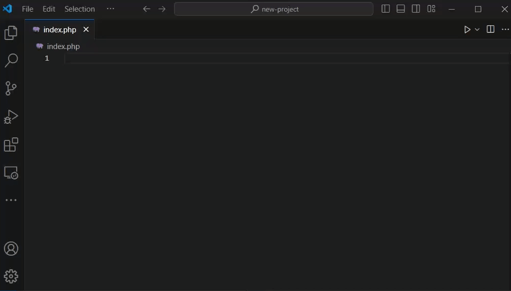
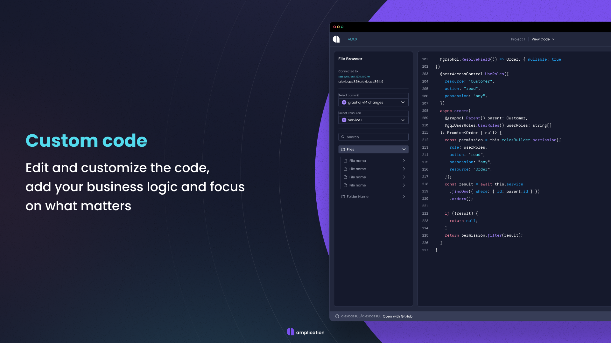
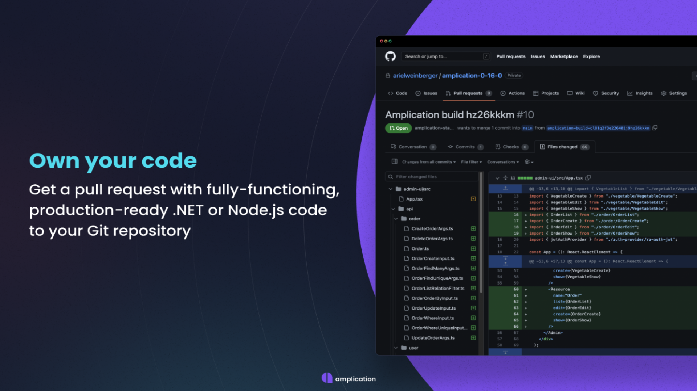
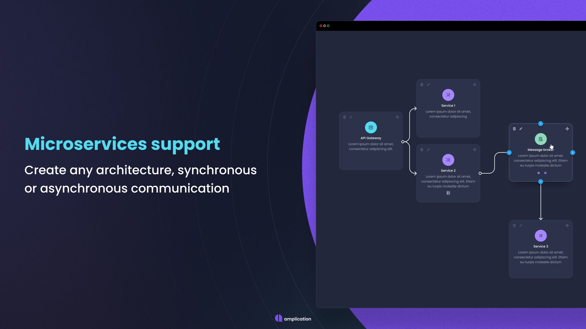
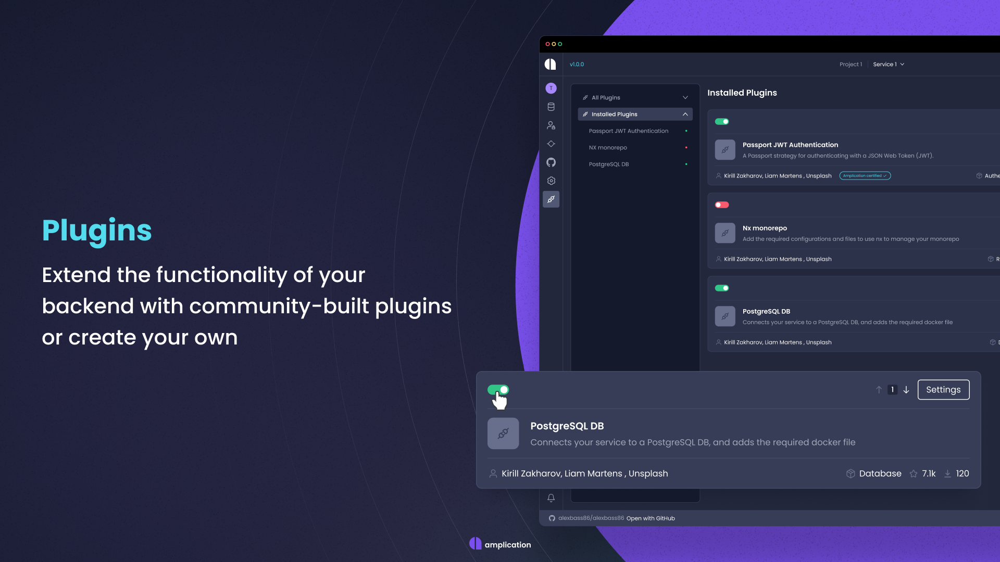

<!--------------------------------------------------------------------------------------------------------
This README.md file was generated using web app repository available at github.com/nicoleweathers/ReadMeGen
---------------------------------------------------------------------------------------------------------->

<style>
.banner1{font-family:"Open Sans",sans-serif;letter-spacing:2px;background-image:linear-gradient(45deg,#415ed0 0%,#c850c0 46%,#ffcc70 100%);text-align:center;padding:7px 10px;font-size:3.5em;font-weight:700;color:#fff;margin-bottom:0}.banner1desc{font-size:.4em;font-weight:400;color:#fff;margin-top:0;display:block}div.banner2{text-align:center}p.banner2{background-image:linear-gradient(180deg,#4388ff 10%,#8400ad 50%,#c0004d 70%);background-clip:text;-webkit-background-clip:text;-webkit-text-fill-color:transparent;padding:7px 10px;font-size:3.5em;margin-bottom:0!important;font-weight:700}span.banner2desc{color:#000;font-weight:700;font-size:1.5em;padding-top:0!important;margin-top:0!important}div.banner3{background:#0e0e0e;padding-bottom:10px;margin-bottom:25px!important}p.banner3{background-image:linear-gradient(to right,#462523 0,#cb9b51 22%,#f6e27a 45%,#f6f2c0 50%,#f6e27a 55%,#cb9b51 78%,#462523 100%);background-clip:text;-webkit-background-clip:text;-webkit-text-fill-color:transparent;padding:7px 10px;font-size:3em;font-weight:400;letter-spacing:3px;text-align:center}.banner3desc{font-weight:700;font-size:1.5em;background-image:linear-gradient(to right,#462523 0,#cb9b51 22%,#f6e27a 45%,#f6f2c0 50%,#f6e27a 55%,#cb9b51 78%,#462523 100%);background-clip:text;-webkit-background-clip:text;-webkit-text-fill-color:transparent;margin-top:0;text-align:center}p.key_feat{padding-bottom:20px;text-align:center}p.key_feat a::after{content:" \2022"}.end_cta{text-align:center;font-size:1.5em;padding-bottom:20px}.end_cta p{font-size:2em;font-weight:600}
</style>


<p align="center">
  
</p>

<p class="banner1">ex. ReadMe Markdown Gen<span class="banner1desc">ex Time Saving  🕐 ReadMe Markdow File Generator</span></p>
        

<p align="center">⭐ Star us on GitHub — it motivates us a lot!</p>

<p class="key_feat"> 
    <a href="#-key-features">&bull; Key Features</a>
    <a href="#-about">About</a>
    <a href="#-installation">Installation</a>
    <a href="#-license">License</a>
    <a href="#-usage">Usage</a>
    <a href="#-download">Download</a>
</p>


<p align="center">
  
</p>

---
<a id="readme-top"></a>

# Table of Contents

<details open>
<summary> &nbsp; &#9756; </summary> <br />

- [Key Features](#-key-features)
- [Screenshots](#-screenshots)
- [About](#-about)
- [Demo](#-demo)
- [Dependencies](#-dependencies)
- [Installation](#-installation)
- [Download](#download)
- [Output Structure](#output-structure)
- [Usage](#-usage)
- [License](#-license)
- [Support](#-support)
- [Contribute](#-contribute)
- [Credits and Acknowledgements](#-credits-and-acknowledgements)
- [Contacts](#-contacts)
  
</details>

<br>


[( ↑ Back to top ↑ )](#readme-top)

---        
        

## &#9733; Key Features

* Preformatted Markdown - Just change the text
  - Designed to look good and save time.
* Demo Content Auto-Generated
  - Every field in form is pre-filled with demo data
* Unlimited Usage
  - Quickly and easily generate a new README.md file for every repository       


[( ↑ Back to top ↑ )](#readme-top)

---        
        

## &#9733; Screenshots


<details open>
<summary> &nbsp; &#9756; </summary> <br />

<p align="center">
    
&nbsp;
    
</p>

<p align="center">
    
&nbsp;
    
</p> 

</details>


[( ↑ Back to top ↑ )](#readme-top)

---        
        

## &#9733; About


[( ↑ Back to top ↑ )](#readme-top)

---        
        

## &#9733; Demo


[-> See a demo here <-](ex. https://nweathers.neocities/readme-md-generator)


[( ↑ Back to top ↑ )](#readme-top)

---        
        

## &#9733; Dependencies

This project has NO DEPENDENCIES, but if it did, it might look something like this...

This software uses the following open source packages:

- [Electron](http://electron.atom.io/)
- [Node.js](https://nodejs.org/)


[( ↑ Back to top ↑ )](#readme-top)

---        
        

## &#9733; Installation

To clone and run this application, from your command line:

```bash
# Clone this repository
$ git clone https://github.com/nicoleweathers/ReadMeMarkdownGen

# Go into the repository
$ cd readme-gen

# Remove git
$ rm -rf .git

# Initialize git on your machine (optional)
$ git init
```


[( ↑ Back to top ↑ )](#readme-top)

---        
        

## Download


You can [download](https://github.com/nicoleweathers/ReadMeMarkdownGen/archive/refs/heads/main.zip) the file instead of cloning.


[( ↑ Back to top ↑ )](#readme-top)

---        
        

## Output Structure


```shell


```


[( ↑ Back to top ↑ )](#readme-top)

---        
        

## &#9733; Usage


[( ↑ Back to top ↑ )](#readme-top)

---        
        

## &#9733; License 

Distributed under the MIT License. See `LICENSE.txt` for more information.


[( ↑ Back to top ↑ )](#readme-top)

---        
        

## &#9733; Support


[( ↑ Back to top ↑ )](#readme-top)

---        
        
## &#9733; Contribute


[( ↑ Back to top ↑ )](#readme-top)

---        
        
## &#9733; Credits and Acknowledgements


[( ↑ Back to top ↑ )](#readme-top)

---        
        

## &#9733; You may also like...


[( ↑ Back to top ↑ )](#readme-top)

---        
        
## &#9733; Contacts

- **Email**: Send us your inquiries or support requests at [youremail@email.com](mailto:youremail@email.com).
- **Website**: [Nicole Weathers](https://nweathers.neocities.com)

> GitHub [@nicoleweathers](https://github.com/nicoleweathers)  · 
> YouTube [@webdgem](https://youtube.com/@webdgem)  · 
> LinkedIn [@ms-nicole-weathers](https://linkedin.com/in/ms-nicole-weathers)  · 


[( ↑ Back to top ↑ )](#readme-top)

---        
        
<div class="end_cta">
<p>Liked the work?</p>

### ⭐ Star us on GitHub — it motivates us a lot!

</div> 

<p class="banner1">ex. ReadMe Markdown Gen<span class="banner1desc">ex Time Saving  🕐 ReadMe Markdow File Generator</span></p>
        

[( ↑ Back to top ↑ )](#readme-top)

---        
        