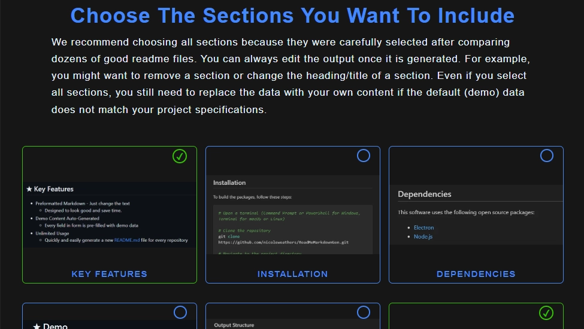
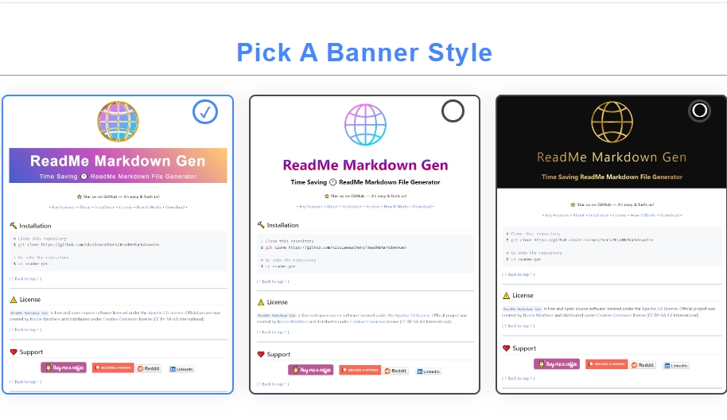

<!--------------------------------------------------------------------------------------------------------
This README.md file was generated using web app repository available at github.com/nicoleweathers/ReadMeGen
---------------------------------------------------------------------------------------------------------->

<style>
.banner1{font-family:"Open Sans",sans-serif;letter-spacing:2px;background-image:linear-gradient(45deg,#415ed0 0%,#c850c0 46%,#ffcc70 100%);text-align:center;padding:7px 10px;font-size:3.5em;font-weight:700;color:#fff;margin-bottom:0}.banner1desc{font-size:.4em;font-weight:400;color:#fff;margin-top:0;display:block}div.banner2{text-align:center}p.banner2{background-image:linear-gradient(180deg,#4388ff 10%,#8400ad 50%,#c0004d 70%);background-clip:text;-webkit-background-clip:text;-webkit-text-fill-color:transparent;padding:7px 10px;font-size:3.5em;margin-bottom:0!important;font-weight:700}span.banner2desc{color:#000;font-weight:700;font-size:1.5em;padding-top:0!important;margin-top:0!important}div.banner3{background:#0e0e0e;padding-bottom:10px;margin-bottom:25px!important}p.banner3{background-image:linear-gradient(to right,#462523 0,#cb9b51 22%,#f6e27a 45%,#f6f2c0 50%,#f6e27a 55%,#cb9b51 78%,#462523 100%);background-clip:text;-webkit-background-clip:text;-webkit-text-fill-color:transparent;padding:7px 10px;font-size:3em;font-weight:400;letter-spacing:3px;text-align:center}.banner3desc{font-weight:700;font-size:1.5em;background-image:linear-gradient(to right,#462523 0,#cb9b51 22%,#f6e27a 45%,#f6f2c0 50%,#f6e27a 55%,#cb9b51 78%,#462523 100%);background-clip:text;-webkit-background-clip:text;-webkit-text-fill-color:transparent;margin-top:0;text-align:center}p.key_feat{padding-bottom:20px;text-align:center}p.key_feat a::after{content:" \2022"}.end_cta{text-align:center;font-size:1.5em;padding-bottom:20px}.end_cta p{font-size:2em;font-weight:600}
</style>


<div class="banner3" style="text-align:center;"><br>
  
  <p class="banner3">ReadMe Markdown Gen</p>
  <p class="banner3desc"></p>
</div>


<p align="center"><strong>⭐ Star us on GitHub — it's easy & it fuels us!</strong></p>

<p class="key_feat"> 
    <a href="#-key-features">&bull; Key Features</a>
    <a href="#-about">About</a>
    <a href="#-installation">Installation</a>
    <a href="#-license">License</a>
    <a href="#-how-it-works">How It Works</a>
    <a href="#-download">Download</a>
</p>


<p align="center">
  
</p>

---
<a id="readme-top"></a>

# Table of Contents

<details open>
<summary> &nbsp; &#9756; </summary> <br />

- [Key Features](#-key-features)
- [About](#-about)
- [Demo](#-demo)
- [Dependencies](#-dependencies)
- [Installation](#-installation)
- [Download](#download)
- [Output Structure](#output-structure)
- [How It Works](#-how-it-works)
- [License](#-license)
- [Support](#-support)
- [Contribute](#-contribute)
- [Contacts](#-contacts)
  
</details>

<br>


[( ↑ Back to top ↑ )](#readme-top)

---        
        

## &#9733; Key Features

* Preformatted Markdown - Just change the text
  - Designed to look good and save time.
* Demo Content Auto-Generated
  - Every field in form is pre-filled with demo data
* Unlimited Usage
  - Quickly and easily generate a new README.md file for every repository       


[( ↑ Back to top ↑ )](#readme-top)

---        
        

## &#9733; Screenshots


<details open>
<summary> &nbsp; &#9756; </summary> <br />

<p align="center">
    
&nbsp;
    
</p>

<p align="center">
    
&nbsp;
    
</p> 

</details>


[( ↑ Back to top ↑ )](#readme-top)

---        
        

## &#9733; About

This generates a nicely formatted markdown ReadMe file, which you can also edit if needed or leave as-is and use in your project. Saves a ton of time because you don't have to manually format a MD file. Just fill in the fields you want to add and let the generator do the the rest.


[( ↑ Back to top ↑ )](#readme-top)

---        
        

## &#9733; Demo


[-> See a demo here <-](https://nweathers.neocities.org/readme-md-generator/)


[( ↑ Back to top ↑ )](#readme-top)

---        
        

## &#9733; Dependencies

This project has NO DEPENDENCIES, but if it did, it might look something like this...

This software uses the following open source packages:

- [Electron](http://electron.atom.io/)
- [Node.js](https://nodejs.org/)


[( ↑ Back to top ↑ )](#readme-top)

---        
        

## &#9733; Installation

To clone and run this application, from your command line:

```bash
# Clone this repository
$ git clone https://github.com/nicoleweathers/ReadMeMarkdownGen

# Go into the repository
$ cd readme-gen

# Remove git
$ rm -rf .git
```


[( ↑ Back to top ↑ )](#readme-top)

---        
        

## Download


You can [download](https://github.com/nicoleweathers/ReadMeMarkdownGen/archive/refs/heads/main.zip) the file instead of cloning.


[( ↑ Back to top ↑ )](#readme-top)

---        
        

## Output Structure


```shell

readme_generator/
├── classes
│   ├── Form.php
│   └── ReadMe.php
├── imgs
│   ├── img1.webp
│   ├── img2.webp
│   └── img3.webp
├── form.php
└── index.php

```


[( ↑ Back to top ↑ )](#readme-top)

---        
        

## &#9733; How It Works

1. Add to htdocs (Xampp) local server and open in browser.
2. Select what you want to include in markdown file.
3. Complete multi-step form with your information
4. Markdown file is generated. Rename it or it will get overwritten next time you run application.
5. If you need to make changes, go back to form. Session data is saved for 30 minutes or until you close browser.


[( ↑ Back to top ↑ )](#readme-top)

---        
        

## 📃 License


[`ReadMe Markdown Gen`](https://github.com/nicoleweathers/ReadMeMarkdownGen) is free and open-source software licensed under 
the Apache 2.0 `License`. Official project was 
created by [Nicole Weathers](https://github.com/nicoleweathers) and distributed under 
`Creative Commons`.


[( ↑ Back to top ↑ )](#readme-top)

---        
        

## &#10084; Support

<a href="https://www.buymeacoffee.com/nweathers" target="_blank">
</a>
<a href="https://www.patreon.com/nikkiwebd">
</a><br><br> Or 

**Share the project link**  with your network on social media >>>

<a href="https://www.reddit.com/submit?url=https%3A%2F%2Fgithub.com%2Fnweathers%2FReadMeMarkdownGen&title=Awesome%20Readme%20Markdown%20File%20Generator!" target="_blank">

</a> 
<a href="https://www.linkedin.com/shareArticle?mini=true&url=https%3A//github.com/nicoleweathers/ReadMeMarkdownGen" target="_blank">
</a> 


[( ↑ Back to top ↑ )](#readme-top)

---        
        
## 🐙 Contribute

Contributions are appreciated; here's how:

1. Fork the Project
2. Create your Feature Branch (`git checkout -b fork/YourContribution`)
3. Commit your Changes (`git commit -m 'Add some YourContribution'`)
4. Push to the Branch (`git push origin fork/YourContribution`)
5. Open a Pull Request


[( ↑ Back to top ↑ )](#readme-top)

---        
        
## 🤝 Credits and Acknowledgements

Here are some credits to my inspiration: 

+ [aimeos-typo3](https://github.com/aimeos/aimeos-typo3#readme) : Nice layout, flow, visually attractive.
+ [electron-markdownify](https://github.com/amitmerchant1990/electron-markdownify#readme) : Great layout and nice design.
+ [werewolves-assistant-api-next](https://github.com/antoinezanardi/werewolves-assistant-api-next#readme) : But I love how complete it is.


[( ↑ Back to top ↑ )](#readme-top)

---        
        

## &#x1F517; You may also like...

- [markdown](https://github.com/gomarkdown/markdown) - Markdown parser and HTML render for GO
- [markdown-cheatsheet](https://github.com/tchapi/markdown-cheatsheet) - Markdown Cheatsheet for Github Readme.md
- [markdown-badges](https://github.com/lleriayo/markdown-badges) - Badges for your personal developer branding, profile, and projects


[( ↑ Back to top ↑ )](#readme-top)

---        
        

## &#x1F4AC; Contacts

- **Email**: Send us your inquiries or support requests at [youremail@email.com](mailto:youremail@email.com).
- **Website**: [Nicole Weathers](https://nweathers.neocities.org)

> GitHub [@nicoleweathers](https://github.com/nicoleweathers)  · 
> YouTube [@webdgem](https://youtube.com/@webdgem)  · 
> LinkedIn [@ms-nicole-weathers](https://linkedin.com/in/ms-nicole-weathers)  · 


[( ↑ Back to top ↑ )](#readme-top)

---        
        
<div class="end_cta">
<p>Liked the work?</p>

### ⭐ Star us on GitHub — it's easy & it fuels us!

</div> 

<div class="banner3" style="text-align:center;"><br>
  
  <p class="banner3">ReadMe Markdown Gen</p>
  <p class="banner3desc"></p>
</div>


[( ↑ Back to top ↑ )](#readme-top)

---        
        