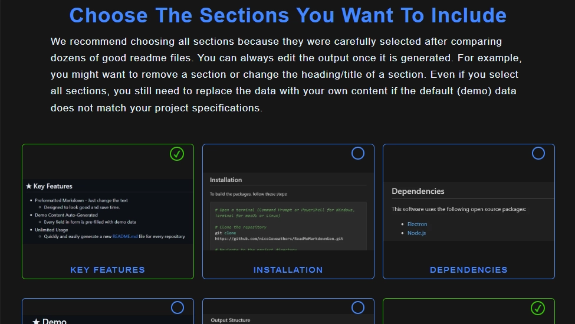
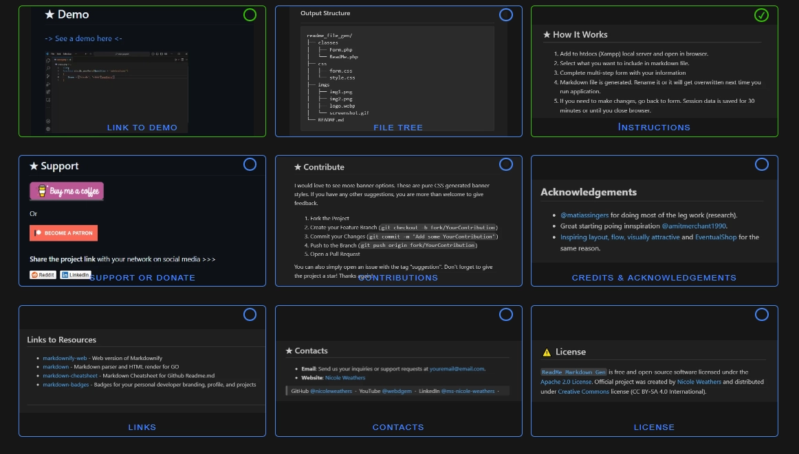
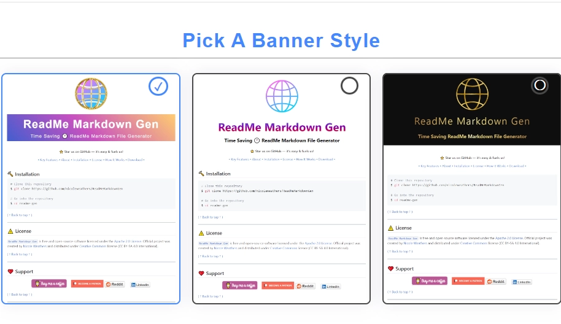
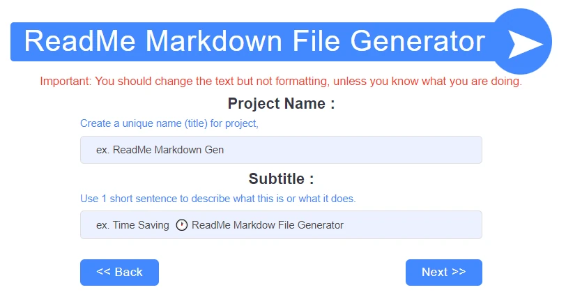

<!-----------------------------------------------------------------------------------------------------
This README.md file was generated using web app repository available at github.com/nicoleweathers/ReadMeGen
------------------------------------------------------------------------------------------------------->

 

 ReadMe Markdown Gen 

  

<strong>⭐ Star us on GitHub — it's easy & it fuels us!</strong>

 
    <a href="#-key-features">&bull; Key Features</a> &bull;
    <a href="#-about">About</a> &bull;
    <a href="#-installation">Installation</a> &bull;
    <a href="#-license">License</a> &bull;
    <a href="#-how-it-works">How It Works</a> &bull;
    <a href="#-download">Download</a> &bull;

  

---

# Table of Contents

 &nbsp; &#9756; 
  

- [Key Features](#-key-features)
- [About](#-about)

- [How It Works](#-how-it-works)

  

 

[( ↑ Back to top ↑ )](#readme-top)

---        
        

## &#9733; Key Features

* Preformatted Markdown - Just change the text
  - Designed to look good and save time.
* Demo Content Auto-Generated
  - Every field in form is pre-filled with demo data
* Unlimited Usage
  - Quickly and easily generate a new README.md file for every repository       

[( ↑ Back to top ↑ )](#readme-top)

---        
        

## &#9733; Screenshots

 &nbsp; &#9756; 
  

    
&nbsp;
    

    
&nbsp;
    

 

[( ↑ Back to top ↑ )](#readme-top)

---        
        

## &#9733; About

This generates a nicely formatted markdown ReadMe file, which you can also edit if needed or leave as-is and use in your project. Saves a ton of time because you don't have to manually format a MD file. Just fill in the fields you want to add and let the generator do the the rest.

[( ↑ Back to top ↑ )](#readme-top)

---        
        

## &#9733; How It Works

1. Add to htdocs (Xampp) local server and open in browser.
2. Select what you want to include in markdown file.
3. Complete multi-step form with your information
4. Markdown file is generated. Rename it or it will get overwritten next time you run application.
5. If you need to make changes, go back to form. Session data is saved for 30 minutes or until you close browser.

[( ↑ Back to top ↑ )](#readme-top)

---        
        

Liked the work?

### ⭐ Star us on GitHub — it's easy & it fuels us!

 

 

 ReadMe Markdown Gen 

  

[( ↑ Back to top ↑ )](#readme-top)

---        
        